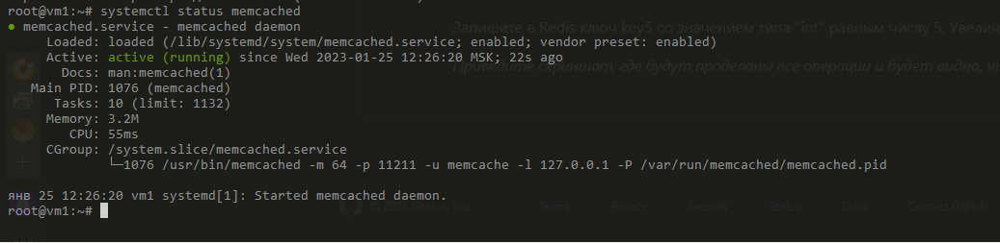
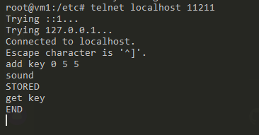
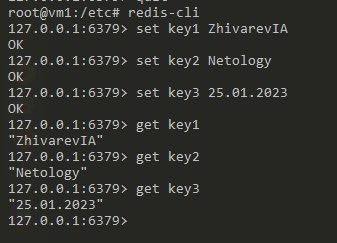

# Домашнее задание к занятию "`11.2. «Кеширование Redis/memcached»`" - `Живарев Игорь`

### Задание 1

`Кэширование – это неотъемлемая часть всех сложных систем. Кэширование позволяет существенно увеличить скорость работы приложения, путем сохранения трудновычислимых данных для их последующего использования. Кэширование позволяет увеличивать производительность приложений за счёт использования сохранённых ранее данных, вроде ответов на сетевые запросы или результатов вычислений. Благодаря кэшу, при очередном обращении клиента за одними и теми же данными, сервер может обслуживать запросы быстрее. Кэширование — эффективный архитектурный паттерн, так как большинство программ часто обращаются к одним и тем же данным и инструкциям. Эта технология присутствует на всех уровнях вычислительных систем. Кэши есть у процессоров, жёстких дисков, серверов, браузеров. Правильно настроенная система кэширования способна значительно улучшить общую производительность сервера. Кэши сокращают задержки, неизбежно возникающие при передаче данных по сети, помогают экономить сетевой трафик, и, в результате, уменьшают время, необходимое для того, чтобы браузер вывел запрошенную у сервера веб-страницу.`

---

### Задание 2

---

### Задание 3

---

### Задание 4

---
